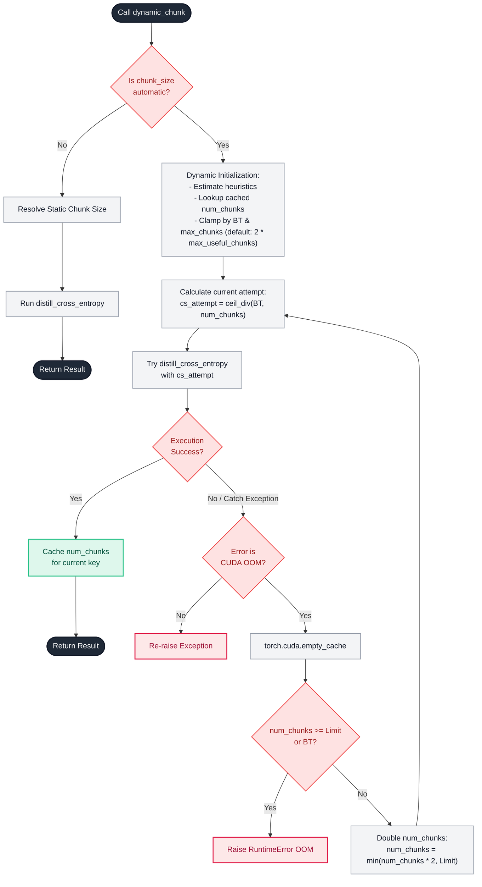
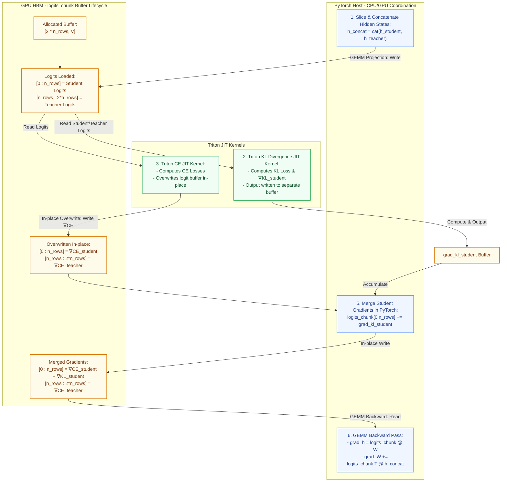

# ORDA CE/KL Loss Kernel — Architecture and Design Documentation

This document provides an overview of the design, module boundaries, data flow, JIT compile-time parameters, and execution sequence of the **ORDA fused Cross Entropy + KL distillation loss kernel** (`orda_ce_kernel`).

In the current library layout, runtime behavior is controlled by explicit call arguments, teacher objects, `KernelConfig`, or the `DistillationLoss` module wrapper.

---

## 1. Directory Structure Map

The source code of the package resides entirely under `[src/orda_ce_kernel/](../src/orda_ce_kernel/)`. Below is the directory tree of the repository's source code along with the exact role of every file:

```
src/
└── orda_ce_kernel/
    ├── __init__.py                     # Package entry point exposing public APIs.
    ├── api.py                          # Public API adapter, validation, torch fallback, and module wrapper.
    ├── _runtime.py                     # Runtime helpers: Triton availability, device checks, libdevice math.
    ├── ops/                            # Autograd operators and Triton JIT CUDA/HIP kernels.
    │   ├── __init__.py                 # Exports for operators and Triton JIT kernels.
    │   ├── cross_entropy.py            # Internal functional operator and DistillCEFunction.
    │   ├── kernels.py                  # Triton JIT kernel for fused Cross Entropy forward & backward passes.
    │   ├── kl_kernel.py                # Triton JIT kernel for fused Kullback-Leibler (KL) divergence and gradients.
    │   └── quant.py                    # Deterministic and stochastic INT8 quantization helpers for weight gradients.
    ├── reference/                      # Reference implementations for testing and validation.
    │   ├── __init__.py                 # Exports reference modules.
    │   └── kl_python_ref.py            # Pure PyTorch baseline for Teacher-Student KL divergence.
    └── utils/                          # Helper utilities for auto-chunking and size resolution.
        ├── __init__.py                 # Exports utility modules.
        ├── dispatcher.py               # Memory-aware dispatcher (dynamic_chunk) with OOM recovery.
        └── resolver.py                 # Algorithmic resolver for dynamic chunk size and count.
```

### Detailed File Roles

* **`[src/orda_ce_kernel/__init__.py](../src/orda_ce_kernel/__init__.py)`**
  Acts as the package entry point. It exports the recommended user-facing API (`distillation_loss`, `DistillationLoss`, teacher objects, `KernelConfig`, `DistillationLossOutput`) and provides `is_available()` to dynamically check Triton and CUDA availability.
* **`[src/orda_ce_kernel/api.py](../src/orda_ce_kernel/api.py)`**
  Contains the public API adapter. It maps `TiedTeacher`, `SeparateTeacher`, and `PrecomputedTeacher` into the internal execution modes, validates public arguments before dispatch, resolves `KernelConfig`/profile values, selects Triton or PyTorch execution, and exposes the `DistillationLoss` module wrapper.
* **`[src/orda_ce_kernel/_runtime.py](../src/orda_ce_kernel/_runtime.py)`**
  Contains runtime helpers used by core kernels: Triton detection, HIP detection, `_LOG2E`, and high-precision libdevice exp/log wrappers.
* **`[src/orda_ce_kernel/ops/__init__.py](../src/orda_ce_kernel/ops/__init__.py)`**
  Exposes the package's core operation methods, JIT kernels, and quantization functions.
* **`[src/orda_ce_kernel/ops/cross_entropy.py](../src/orda_ce_kernel/ops/cross_entropy.py)`**
  Contains the internal functional operator `distill_cross_entropy` and the PyTorch autograd wrapper `DistillCEFunction`. It resolves explicit kernel options, chunks hidden states, builds logits by teacher mode, dispatches CE/KL Triton kernels, accumulates manual gradients, and optionally applies INT8 compression.
* **`[src/orda_ce_kernel/ops/kernels.py](../src/orda_ce_kernel/ops/kernels.py)`**
  Contains `_exact_ce_fwdbwd_kernel_merged`, a fused exact cross-entropy Triton kernel that performs both the forward loss calculation and backward gradient computation in-place inside the logit buffer, significantly optimizing memory throughput.
* **`[src/orda_ce_kernel/ops/kl_kernel.py](../src/orda_ce_kernel/ops/kl_kernel.py)`**
  Implements `_kl_from_logits_chunk_kernel` which performs KL divergence calculations between teacher and student distributions, alongside its Python wrapper `kl_from_logits_chunk` and in-place helper `add_kl_grad_to_logits_chunk_`.
* **`[src/orda_ce_kernel/ops/quant.py](../src/orda_ce_kernel/ops/quant.py)`**
  Implements memory compression logic. It defines row-wise INT8 deterministic quantization (banker's rounding), row-wise INT8 stochastic quantization (unbiased rounding using uniform noise), and helpers for weight gradients (`quantize_grad_w`/`dequantize_grad_w`) which keep the target logits' updates in FP16 while quantizing the rest.
  > [!NOTE]
  > **Deterministic vs. Stochastic Rounding**: 
  > * **Deterministic Rounding** (`stochastic=False`): Computationally simpler but introduces rounding bias, which can stall convergence in deep models.
  > * **Stochastic Rounding** (`stochastic=True`): Unbiased in expectation, yielding better convergence, but incurs a minor performance overhead due to random number generation on the GPU. Recommended for training large models.
* **`[src/orda_ce_kernel/reference/__init__.py](../src/orda_ce_kernel/reference/__init__.py)`**
  Initializes the reference baseline module.
* **`[src/orda_ce_kernel/reference/kl_python_ref.py](../src/orda_ce_kernel/reference/kl_python_ref.py)`**
  Implements a native PyTorch baseline `kl_python_chunk` for Teacher-Student KL divergence calculation, used to verify the correctness of the Triton JIT implementation.
* **`[src/orda_ce_kernel/utils/__init__.py](../src/orda_ce_kernel/utils/__init__.py)`**
  Exposes memory management helper utilities.
* **`[src/orda_ce_kernel/utils/dispatcher.py](../src/orda_ce_kernel/utils/dispatcher.py)`**
  Defines `dynamic_chunk`, a fault-tolerant dispatcher that executes the cross-entropy function, monitors execution for Out-Of-Memory (OOM) errors, clears the CUDA cache, doubles the chunk count on failure, and caches successful configurations.
* **`[src/orda_ce_kernel/utils/resolver.py](../src/orda_ce_kernel/utils/resolver.py)`**
  Computes the optimal chunk size and chunk count. It resolves manual static sizes and implements memory-pressure heuristics for automatic dynamic configuration.

---

## 2. Complete Catalog of Classes, Functions, and JIT Kernels

The catalogs are restructured into 8 logical categories mapping 100% of all functions, classes, and Triton JIT kernels inside the repository.

### I. Package Entrypoint & Public API
Exposed in `[src/orda_ce_kernel/__init__.py](../src/orda_ce_kernel/__init__.py)` and `[src/orda_ce_kernel/api.py](../src/orda_ce_kernel/api.py)`.

| Component Name | Type | Source File | Parameters | Role & Behavior |
| :--- | :--- | :--- | :--- | :--- |
| `is_available` | Function | `[src/orda_ce_kernel/__init__.py](../src/orda_ce_kernel/__init__.py)` | None | **Checks system compatibility**. Returns `True` if Triton is imported and a CUDA/HIP-capable device is available in PyTorch. |
| `distillation_loss` | Function | `[src/orda_ce_kernel/api.py](../src/orda_ce_kernel/api.py)` | `student_hidden, weight, labels, teacher, ...` | **Recommended public loss API**. Validates inputs, resolves teacher semantics and kernel options, then dispatches to Triton or the PyTorch reference path. |
| `DistillationLoss` | Class | `[src/orda_ce_kernel/api.py](../src/orda_ce_kernel/api.py)` | Constructor stores public loss options | **Module wrapper**. Stores explicit public API options and calls `distillation_loss` in `forward`. |
| `DistillationLossOutput` | NamedTuple | `[src/orda_ce_kernel/api.py](../src/orda_ce_kernel/api.py)` | `loss, student_ce, teacher_ce, kl` | **Structured output**. Returns the total loss and raw component losses. |
| `TiedTeacher` | Frozen dataclass | `[src/orda_ce_kernel/api.py](../src/orda_ce_kernel/api.py)` | `hidden` | **Teacher case** where student and teacher use the same output projection weight. |
| `SeparateTeacher` | Frozen dataclass | `[src/orda_ce_kernel/api.py](../src/orda_ce_kernel/api.py)` | `hidden, weight` | **Teacher case** where the teacher has its own projection weight. |
| `PrecomputedTeacher` | Frozen dataclass | `[src/orda_ce_kernel/api.py](../src/orda_ce_kernel/api.py)` | `logits` | **Teacher case** where teacher logits are supplied directly and do not carry gradients. |
| `KernelConfig` | Frozen dataclass | `[src/orda_ce_kernel/api.py](../src/orda_ce_kernel/api.py)` | Kernel option fields | **Explicit kernel tuning object**. Carries compile/runtime options used by the public API adapter and core dispatch path. |

`DistillationLossOutput.student_ce`, `teacher_ce`, and `kl` are detached reported
components. The total `loss` tensor is the backward-carrying objective. With
`PrecomputedTeacher`, `teacher_ce_weight > 0` reports the teacher CE value from
the supplied logits without creating a teacher gradient path.

`KernelConfig.fp32_grad_weight_accumulation` is the canonical field for FP32
weight-gradient accumulation. `fp32_accumulation` remains accepted as an alias
when it does not conflict with the canonical field. `profile="fast"` enables
fast math only; quantized grad-weight storage and stochastic rounding are
explicit opt-ins. `profile="debug"` is a numerical-reference/debug preset, not a
performance profiler mode.

CUDA execution uses fp16 kernel compute buffers; HIP execution uses bf16 kernel
compute buffers. Supported input dtypes should not be read as full-fp32 compute.
T4/fp16 is the current validation/performance reporting scope unless a benchmark
explicitly names another GPU. Kernel launch constants such as `num_warps` are
tuned internal constants, not portable optimality claims.

### II. Runtime Helpers
Runtime helpers live in `[src/orda_ce_kernel/_runtime.py](../src/orda_ce_kernel/_runtime.py)`.

| Component Name | Type | Source File | Parameters | Role & Behavior |
| :--- | :--- | :--- | :--- | :--- |
| `is_hip` | Function | `[src/orda_ce_kernel/_runtime.py](../src/orda_ce_kernel/_runtime.py)` | None | **Platform check**. Returns `True` if PyTorch is running on AMD ROCm/HIP. |
| `_LOG2E`, `tl_highprec_exp`, `tl_highprec_log` | Constant/JIT helpers | `[src/orda_ce_kernel/_runtime.py](../src/orda_ce_kernel/_runtime.py)` | None | **Runtime math helpers** used by CE/KL Triton kernels. |

### III. PyTorch Autograd Wrappers & Core Operator Interfaces
Bridges the public API and the optimized Triton kernels under `[src/orda_ce_kernel/ops/cross_entropy.py](../src/orda_ce_kernel/ops/cross_entropy.py)` and `[src/orda_ce_kernel/ops/kl_kernel.py](../src/orda_ce_kernel/ops/kl_kernel.py)`.

| Component Name | Type | Source File | Parameters | Role & Behavior |
| :--- | :--- | :--- | :--- | :--- |
| `DistillCEFunction` | Class | `[src/orda_ce_kernel/ops/cross_entropy.py](../src/orda_ce_kernel/ops/cross_entropy.py)` | `torch.autograd.Function` | **Autograd Operator**. Fuses teacher-student projection, runs sequence chunks, launches JIT kernels, merges gradients, and runs INT8 quantization in the backprop. |
| `DistillCEFunction.forward` | Static Method | `[src/orda_ce_kernel/ops/cross_entropy.py](../src/orda_ce_kernel/ops/cross_entropy.py)` | `ctx, h_student, h_teacher, weight, target, ...` | **Forward pass**. Concatenates student/teacher hidden states, performs single-GEMM logits, launches Triton CE/KL kernels, and caches values for backprop. |
| `DistillCEFunction.backward` | Static Method | `[src/orda_ce_kernel/ops/cross_entropy.py](../src/orda_ce_kernel/ops/cross_entropy.py)` | `ctx, grad_output` | **Backward pass**. Restores weight precision via dequantization and computes input activation gradients scaled by `grad_output`. |
| `distill_cross_entropy` | Function | `[src/orda_ce_kernel/ops/cross_entropy.py](../src/orda_ce_kernel/ops/cross_entropy.py)` | `h_student, h_teacher, weight, target, lambda_student, ignore_index, reduction, label_smoothing, chunk_size, ...` | **Internal core operator**. Applies `DistillCEFunction` after low-level validation and explicit option resolution. New user code should enter through `distillation_loss`. |
| `kl_from_logits_chunk` | Function | `[src/orda_ce_kernel/ops/kl_kernel.py](../src/orda_ce_kernel/ops/kl_kernel.py)` | `logits_chunk, targets_chunk, n_rows, kl_weight, kl_temperature, n_non_ignore, ignore_index, ...` | **KL Wrapper**. Validates shapes and device mapping, allocates memory for outputs, and dispatches the JIT KL kernel. |
| `add_kl_grad_to_logits_chunk_` | Function | `[src/orda_ce_kernel/ops/kl_kernel.py](../src/orda_ce_kernel/ops/kl_kernel.py)` | Same as `kl_from_logits_chunk` | **In-place KL Helper**. Runs `kl_from_logits_chunk` and adds the returned student gradients to the student portion of the logits chunk in-place. |

### IV. Triton JIT Computations & Kernels
Optimized JIT CUDA/HIP implementations executing parallel thread grids.

| Component Name | Type | Source File | Grid Mapping | Core Role & Behaviors |
| :--- | :--- | :--- | :--- | :--- |
| `_exact_ce_fwdbwd_kernel_merged` | JIT Kernel | `[src/orda_ce_kernel/ops/kernels.py](../src/orda_ce_kernel/ops/kernels.py)` | `(2 * n_rows,)` | **Fused CE operations**. Fuses CE forward loss computation and backward logit gradient computation in-place. Maps thread blocks directly to individual logit rows. Supports online/offline softmax, label smoothing, and fast math flags. |
| `_kl_from_logits_chunk_kernel` | JIT Kernel | `[src/orda_ce_kernel/ops/kl_kernel.py](../src/orda_ce_kernel/ops/kl_kernel.py)` | `(n_rows,)` | **Fused KL operations**. Computes per-row KL divergence and student logit gradients. Executes parallel maximum sweeps and sum-exp reductions, upcasts sum calculations to FP32, and stores gradients. |

### V. JIT-Compatible Mathematical Backends
High-precision math abstractions mapped inside JIT contexts to avoid compiler library link faults.

| Component Name | Type | Source File | Parameters | Role & Behavior |
| :--- | :--- | :--- | :--- | :--- |
| `tl_highprec_exp` | JIT Helper | `[src/orda_ce_kernel/_runtime.py](../src/orda_ce_kernel/_runtime.py)` | `x` | Loads the GPU device library `exp` implementation. Falls back to default `tl.exp` if libdevice is missing. |
| `tl_highprec_log` | JIT Helper | `[src/orda_ce_kernel/_runtime.py](../src/orda_ce_kernel/_runtime.py)` | `x` | Loads the GPU device library `log` implementation. Falls back to default `tl.log` if libdevice is missing. |
| `_kl_highprec_exp` | JIT Helper | `[src/orda_ce_kernel/ops/kl_kernel.py](../src/orda_ce_kernel/ops/kl_kernel.py)` | `x` | Invokes the Triton compiler's high-precision `exp` inside the KL JIT kernel. |
| `_kl_highprec_log` | JIT Helper | `[src/orda_ce_kernel/ops/kl_kernel.py](../src/orda_ce_kernel/ops/kl_kernel.py)` | `x` | Invokes the Triton compiler's high-precision `log` inside the KL JIT kernel. |

### VI. Gradient Compression & INT8 Quantization Ops
Row-wise memory-saving helpers located in `[src/orda_ce_kernel/ops/quant.py](../src/orda_ce_kernel/ops/quant.py)`.

| Component Name | Type | Source File | Parameters | Role & Behavior |
| :--- | :--- | :--- | :--- | :--- |
| `quantize_rowwise_int8` | Function | `[src/orda_ce_kernel/ops/quant.py](../src/orda_ce_kernel/ops/quant.py)` | `tensor` | **Deterministic Quantization**. Finds maximum absolute row values, scales values by `max_val / 127`, and rounds to INT8 using banker's rounding. |
| `quantize_rowwise_int8_stochastic` | Function | `[src/orda_ce_kernel/ops/quant.py](../src/orda_ce_kernel/ops/quant.py)` | `tensor, generator` | **Stochastic Quantization**. Scales values by `max_val / 127` and rounds stochastically using uniform noise, ensuring unbiased gradients. |
| `dequantize_rowwise_int8` | Function | `[src/orda_ce_kernel/ops/quant.py](../src/orda_ce_kernel/ops/quant.py)` | `quantized, scale` | **Dequantization**. Casts INT8 values back to target high-precision types and applies scales. |
| `quantize_grad_w` | Function | `[src/orda_ce_kernel/ops/quant.py](../src/orda_ce_kernel/ops/quant.py)` | `grad_W, target, ignore_index, quantize_fn` | **Partial compression**. Identifies and copies targets' weight gradient rows in clean FP16/BF16 precision, then compresses other rows to INT8. |
| `dequantize_grad_w` | Function | `[src/orda_ce_kernel/ops/quant.py](../src/orda_ce_kernel/ops/quant.py)` | `grad_W_a, grad_W_scale, grad_W_target, unique_targets, grad_output` | **Dequantization manager**. Reconstructs high-precision weight gradient tensor, merges target rows, and scales by `grad_output`. |

### VII. Memory-Aware Dispatcher & Resolution Utilities
Dynamic adaptive mechanics in `[src/orda_ce_kernel/utils/](../src/orda_ce_kernel/utils/)`.

| Component Name | Type | Source File | Parameters | Role & Behavior |
| :--- | :--- | :--- | :--- | :--- |
| `dynamic_chunk` | Function | `[src/orda_ce_kernel/utils/dispatcher.py](../src/orda_ce_kernel/utils/dispatcher.py)` | `h_student, h_teacher, weight, target, ..., max_chunks` | **Adaptive Executor**. Wraps CE execution with automated CUDA cache eviction and chunk-size adjustment loops to prevent Out-Of-Memory exceptions. |
| `resolve_chunk_size` | Function | `[src/orda_ce_kernel/utils/resolver.py](../src/orda_ce_kernel/utils/resolver.py)` | `BT, chunk_size_arg, V, max_chunks` | **Algorithmic Resolver**. Computes optimum static block sizes or evaluates memory-pressure heuristics `(BT/1024) * (V/32768)^2` to resolve dynamic chunk counts. |
| `_chunk_size_from_num_chunks` | Function | `[src/orda_ce_kernel/utils/dispatcher.py](../src/orda_ce_kernel/utils/dispatcher.py)` | `BT, num_chunks` | Computes individual sequence segment row limits via ceiling division. |
| `_is_oom_error` | Function | `[src/orda_ce_kernel/utils/dispatcher.py](../src/orda_ce_kernel/utils/dispatcher.py)` | `exc` | Inspects exception properties and message strings to check if they represent a GPU Out-Of-Memory condition. |
| `_cache_key` | Function | `[src/orda_ce_kernel/utils/dispatcher.py](../src/orda_ce_kernel/utils/dispatcher.py)` | Shape, device, dtype, mode, config-relevant fields | Formulates the dynamic chunk cache key across tensor/device/config fields that affect memory behavior. |
| `clear_chunk_cache` | Function | `[src/orda_ce_kernel/utils/dispatcher.py](../src/orda_ce_kernel/utils/dispatcher.py)` | None | Wipes all elements from the successful dispatcher caching dictionaries. |
| `get_chunk_cache` | Function | `[src/orda_ce_kernel/utils/dispatcher.py](../src/orda_ce_kernel/utils/dispatcher.py)` | None | Returns a duplicate dict copy of the dispatcher chunk size cache. |
| `_is_auto_chunk_size` | Function | `[src/orda_ce_kernel/utils/resolver.py](../src/orda_ce_kernel/utils/resolver.py)` | `chunk_size` | Returns `True` if argument indicates automatic chunk resolution (`None`, `"auto"`, `"dynamic"`, `-2`, or `<= 0`). |
| `_chunks_from_raw` | Function | `[src/orda_ce_kernel/utils/resolver.py](../src/orda_ce_kernel/utils/resolver.py)` | `raw` | Maps continuous memory-pressure scores to a power-of-two chunk count. |

### VIII. Python Reference Baselines
Validations located under `[src/orda_ce_kernel/reference/](../src/orda_ce_kernel/reference/)`.

| Component Name | Type | Source File | Parameters | Role & Behavior |
| :--- | :--- | :--- | :--- | :--- |
| `kl_python_chunk` | Function | `[src/orda_ce_kernel/reference/kl_python_ref.py](../src/orda_ce_kernel/reference/kl_python_ref.py)` | `logits_chunk, t_c, n_rows, kl_weight, kl_temperature, n_non_ignore, ignore_index, compute_grad` | **Reference verification**. Pure PyTorch-native implementation of Teacher-Student KL divergence and gradients used for correctness assertions. |

---

## 3. Triton constexpr Compile Flags

Triton JIT kernels compile specialized binary variants for different combinations of `constexpr` compile-time constants. The JIT compiler uses these constants to prune branches, optimize register layout, and unroll loops:

### 3.1. `ONLINE_SOFTMAX` (`tl.constexpr` — Boolean)
* **Goal**: Selects the algorithm used for computing the softmax maximum scan and sum of exponentials.
* **Mechanism**:
  * **Milakov Online Softmax (True)**: Fuses maximum search and running sum calculations into a **single HBM read sweep**. Adjusts previous running sums on the fly using scaling factors $\exp(mOld - mNew)$ whenever a new block max is found. **Minimizes memory bandwidth overhead**.
  * **Fixed-Shift Softmax (False)**: Standard 3-pass implementation. Pass 1 finds the **global maximum** ($m$), and Pass 2 computes the **sum of exponentials** ($d = \sum \exp(x - m)$). Requires **extra HBM read sweeps** to re-load logits.

### 3.2. `FAST_MATH_EXP` (`tl.constexpr` — Boolean)
* **Goal**: Controls the mathematical backend for exponentiation operations.
* **Mechanism**:
  * **Approximate Hardware (True)**: Uses base-2 hardware instructions rewritten as `tl.math.exp2((x - m) * log2(e))`. **Fast execution** but introduces a minor error (**~4 ULP**, up to $10^{-4}$ deviation).
  * **Libdevice Precision (False)**: Uses high-precision `exp` mapping directly to GPU vendor libraries. **Prioritizes numerical precision** over speed.

> [!WARNING]
> **Numerical Deviation Risk**: Setting `KernelConfig(fast_math=True)` enables approximate GPU math paths such as `exp2.approx`. This can introduce small numerical differences compared with standard PyTorch. Keep `fast_math=False` when exactness is more important than throughput.

> [!NOTE]
> **KL Kernel Caveat**: In the KL JIT kernel (`_kl_from_logits_chunk_kernel`), when `FAST_MATH_EXP` is set to `False`, it falls back to Triton's standard `tl.math.exp` (via the `_kl_highprec_exp` helper) rather than external GPU libdevice libraries. This design decision ensures maximum compiler portability for KL computations across different GPU architectures.

### 3.3. `FAST_MATH_LOG` (`tl.constexpr` — Boolean)
* **Goal**: Controls the mathematical backend for logarithm calculations.
* **Mechanism**:
  * **Approximate Hardware (True)**: Invokes native GPU `tl.math.log` to minimize clock cycles in **Log-Sum-Exp** calculations.
  * **Libdevice Precision (False)**: Employs vendor library `tl_highprec_log` to avoid **numerical drift** in gradients.

> [!NOTE]
> **KL Kernel Caveat**: In the KL JIT kernel (`_kl_from_logits_chunk_kernel`), when `FAST_MATH_LOG` is set to `False`, it falls back to Triton's standard `tl.math.log` (via the `_kl_highprec_log` helper) rather than external GPU libdevice libraries. This design decision ensures maximum compiler portability for KL computations across different GPU architectures.

### 3.4. `FAST_MATH_MUL` (`tl.constexpr` — Boolean)
* **Goal**: Replaces expensive logit divisions with fast multiplications.
* **Mechanism**:
  * **Reciprocal Multiplications (True)**: Precomputes the reciprocal denominator `inv_d = 1.0 / d`. Softmax probability is calculated as $prob = \exp(x - m) \times invD$. Multiplications have **much higher throughput** than divisions on CUDA/HIP GPUs.
  * **Direct Divisions (False)**: Computes $prob = \exp(x - m) / d$ directly. **Slower** due to division latency.

### 3.5. `BLOCK_SIZE` (`tl.constexpr` — Integer)
* **Goal**: Defines the vocabulary slice width processed per thread block.
* **Mechanism**: Statically resolved based on vocabulary size $V$, clamped by the `max_fused_size` argument (default: 32768). Allowing it to be a compile-time constant helps the compiler optimize **register allocation** and unroll loops.

### 3.6. `label_smoothing` (`tl.constexpr` — Float)
* **Goal**: Determines if label smoothing is active (> 0.0) or inactive (== 0.0).
* **Mechanism**: Statically compiled into the cross-entropy kernel. If $\alpha > 0.0$, the JIT compiler keeps the logic to accumulate uniform loss contribution $\frac{\alpha}{V}$. If $\alpha == 0.0$, these branches are **pruned entirely**, reducing register usage.

---

## 4. Architectural Execution Flow and Optimization

To optimize memory usage and prevent Out-Of-Memory (OOM) errors during computation with large vocabularies, the ORDA kernel implements three core mechanisms:
1. **Sequence Chunking**: Splits the data batch along the sequence dimension (sequence length $B \times T$) into smaller segments (chunks) to process them sequentially.
2. **Concatenated GEMM**: Concatenates Student and Teacher hidden states into a single GEMM projection, using a single shared buffer (`logits_chunk`).
3. **In-Place Computation**: Triton JIT kernels read from the shared `logits_chunk` and overwrite it in-place with scaled gradients, minimizing HBM memory traffic.

---

### 4.1. Automatic Chunk Resolution and Safety Limits (Auto-Chunking & Safety Caps)

To dynamically resolve the optimal chunk count for any combination of sequence length ($BT$) and vocabulary size ($V$), the system applies the following mathematical rules and bounds:

1. **Memory-Pressure Heuristics ($\text{raw}$)**:
   The raw pressure score is evaluated scaling quadratically with vocabulary size and linearly with batch token size:

   ```text
   raw_pressure = (BT / 1024) * (V / 32768)^2
   ```

   ```text
   raw_bt_floor = BT / 4096
   ```

   ```text
   raw = max(raw_pressure, raw_bt_floor)
   ```

   The raw chunk count (`num_chunks_raw`) is mapped exponentially:

   ```text
   num_chunks_raw = 2^(floor(log2(raw / 1.5)) + 1)
   ```

   This rule applies for `raw >= 1.5`; otherwise the raw chunk count is `1`.

2. **Occupancy Limit (`max_useful_chunks`)**:
   To prevent GPU under-utilization (Streaming Multiprocessors starvation) due to extremely small grids, each chunk must process at least $512$ tokens:

   ```text
   max_useful_chunks = max(1, BT // 512)
   ```

3. **Ceiling Limit (`max_chunks`)**:
   * **During initial suggestion (Dynamic Chunk)**: The proposed chunk count is bounded to ensure hardware occupancy:

     ```text
     num_chunks = min(max_chunks, max_useful_chunks, num_chunks_raw, BT)
     ```

     *If `max_chunks` is not explicitly passed, it automatically defaults to* `2 * max_useful_chunks`.
   * **During OOM retries (Fallback OOM)**: If a CUDA OOM occurs, the system evicts cache and doubles the chunk count up to `max_chunks` to keep the training alive.

---

### 4.2. Dynamic Chunk Dispatcher Flow (`dynamic_chunk`)

The OOM-resilient dispatcher dynamically searches for a safe chunk size:



> [!TIP]
> **OOM Tuning**: If the dispatcher throws a RuntimeError after exhausting the maximum chunk count:
> 1. Increase the chunk count limit with `KernelConfig(max_chunks=32)`.
> 2. Enable FP32 accumulation with `KernelConfig(fp32_grad_weight_accumulation=True)` when gradient accumulation precision is the limiting factor.
> 3. Reduce your micro-batch size or sequence length if memory limits are exceeded.

---

### 4.3. Fused Execution Flow: CE Kernel + KL Kernel (on the same `logits_chunk`)

To optimize memory bandwidth, both Triton kernels operate on the same `logits_chunk` buffer of size `[2 * n_rows, V]` (with Student logits in the first half, Teacher logits in the second half):



---

### 4.4. `logits_chunk` Memory Operations Timeline

Below is the step-by-step sequence of read/write operations performed on the shared `logits_chunk` buffer within a single chunk iteration:

| Step | Operation | Target Buffer Slice | Operation Type | Purpose |
| :---: | :--- | :--- | :---: | :--- |
| **1** | **GEMM Projection** | `logits_chunk` | **Write** | Populates logits for both Student and Teacher. |
| **2** | **Triton KL Kernel** | `logits_chunk` | **Read** | Reads clean Student & Teacher logits to compute KL Loss and `∇KL_s`. |
| **3** | **Triton CE Kernel** | `logits_chunk` | **Read** | Reads logits to compute Cross Entropy (NLL) Loss. |
| **4** | **Triton CE Kernel** | `logits_chunk` | **Overwrite** | Overwrites scaled CE gradients (`∇CE` for student/teacher) **in-place**. |
| **5** | **Gradient Merging** | `logits_chunk[:n_rows]` | **Write (Accumulate)** | Fuses Student KL gradients (`grad_kl_s`) in-place: `∇CE_s += ∇KL_s`. |
| **6** | **GEMM Backward** | `logits_chunk` | **Read** | Multiplies with `W` to compute activation gradients (`grad_h`) and accumulate `grad_W`. |

> [!IMPORTANT]
> **Inviolable Execution Sequence**: The Triton KL Kernel **must** finish reading from `logits_chunk` before the Triton CE Kernel overwrites it. If this sequence is violated, clean logits are lost (overwritten by $\nabla\text{CE}$), leading to corrupted divergence calculations. This is why the Python wrapper executes the KL flow before dispatching the merged CE kernel.
