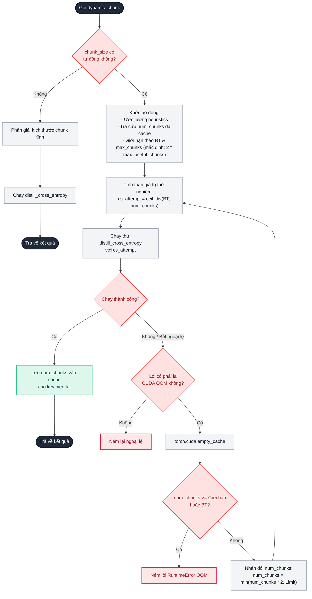
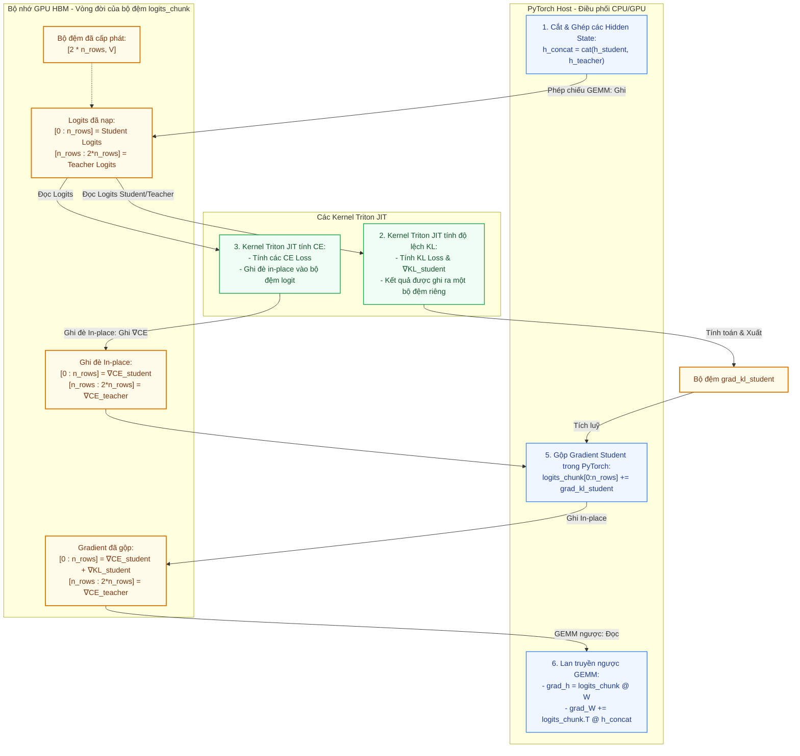

# Tài liệu Kiến trúc và Thiết kế ORDA CE/KL Loss Kernel

Tài liệu này cung cấp một cái nhìn tổng quan về thiết kế, ranh giới module, luồng dữ liệu, tham số JIT compile-time, và trình tự thực thi của **ORDA fused Cross Entropy + KL distillation loss kernel** (`orda_ce_kernel`).

Trong layout hiện tại, runtime behavior được điều khiển bằng tham số truyền vào hàm, teacher object, `KernelConfig`, hoặc module wrapper `DistillationLoss`.

---

## 1. Bản đồ Cấu trúc Thư mục

Mã nguồn của gói nằm hoàn toàn trong thư mục `[src/orda_ce_kernel/](../src/orda_ce_kernel/)`. Dưới đây là cây thư mục mã nguồn và vai trò chính xác của từng tệp:

```
src/
└── orda_ce_kernel/
    ├── __init__.py                     # Điểm khởi đầu gói cung cấp API công khai.
    ├── api.py                          # Adapter API công khai, validation, torch fallback, và module wrapper.
    ├── _runtime.py                     # Runtime helper: Triton availability, device checks, libdevice math.
    ├── ops/                            # Các toán tử autograd và kernel Triton JIT CUDA/HIP.
    │   ├── __init__.py                 # Xuất các toán tử và kernel Triton JIT.
    │   ├── cross_entropy.py            # Internal functional operator và DistillCEFunction.
    │   ├── kernels.py                  # Kernel Triton JIT thực thi fused Cross Entropy forward & backward.
    │   ├── kl_kernel.py                # Kernel Triton JIT thực thi Kullback-Leibler (KL) divergence và gradients.
    │   └── quant.py                    # Trợ giúp lượng tử hóa INT8 (định hướng/ngẫu nhiên) cho gradient của trọng số.
    ├── reference/                      # Triển khai tham chiếu phục vụ kiểm thử và xác thực.
    │   ├── __init__.py                 # Xuất các module tham chiếu.
    │   └── kl_python_ref.py            # Triển khai baseline PyTorch thuần của Teacher-Student KL divergence.
    └── utils/                          # Công cụ hỗ trợ chia nhỏ chunk tự động và phân giải kích thước.
        ├── __init__.py                 # Xuất các module tiện ích.
        ├── dispatcher.py               # Bộ điều phối phân chia bộ nhớ (dynamic_chunk) có khả năng tự phục hồi khi OOM.
        └── resolver.py                 # Bộ phân giải thuật toán cho kích thước và số lượng chunk động.
```

### Vai trò Chi tiết của Từng Tệp

* **`[src/orda_ce_kernel/__init__.py](../src/orda_ce_kernel/__init__.py)`**
  Đóng vai trò là điểm truy cập package. Nó export API khuyến nghị cho user (`distillation_loss`, `DistillationLoss`, teacher objects, `KernelConfig`, `DistillationLossOutput`) và cung cấp `is_available()` để kiểm tra khả năng sử dụng Triton và CUDA.
* **`[src/orda_ce_kernel/api.py](../src/orda_ce_kernel/api.py)`**
  Chứa API công khai. File này ánh xạ `TiedTeacher`, `SeparateTeacher`, và `PrecomputedTeacher` sang execution mode nội bộ, validate tham số public trước khi dispatch, resolve `KernelConfig`/profile, chọn Triton hoặc PyTorch execution, và cung cấp module wrapper `DistillationLoss`.
* **`[src/orda_ce_kernel/_runtime.py](../src/orda_ce_kernel/_runtime.py)`**
  Chứa các helper runtime dùng bởi core: kiểm tra Triton, phát hiện HIP, `_LOG2E`, và wrapper hàm mũ/log chính xác cao từ libdevice.
* **`[src/orda_ce_kernel/ops/__init__.py](../src/orda_ce_kernel/ops/__init__.py)`**
  Công bố các phương thức vận hành cốt lõi, nhân JIT, và các hàm lượng tử hóa của thư viện.
* **`[src/orda_ce_kernel/ops/cross_entropy.py](../src/orda_ce_kernel/ops/cross_entropy.py)`**
  Chứa internal functional operator `distill_cross_entropy` và lớp autograd PyTorch `DistillCEFunction`. File này resolve option explicit, chia chunk, tạo logits theo mode teacher, điều phối CE/KL Triton kernel, tích lũy gradient thủ công, và nén INT8 khi được bật.
* **`[src/orda_ce_kernel/ops/kernels.py](../src/orda_ce_kernel/ops/kernels.py)`**
  Chứa kernel Triton `_exact_ce_fwdbwd_kernel_merged` thực hiện song song cả quá trình tính toán loss (NLL) ở chiều forward và tính toán gradient logits ở chiều backward trực tiếp **in-place** trên buffer logits ban đầu, tối ưu hóa đáng kể băng thông bộ nhớ.
* **`[src/orda_ce_kernel/ops/kl_kernel.py](../src/orda_ce_kernel/ops/kl_kernel.py)`**
  Triển khai kernel JIT `_kl_from_logits_chunk_kernel` dùng để tính toán độ lệch KL (KL divergence) giữa phân phối của teacher và student, kèm theo wrapper Python `kl_from_logits_chunk` và hàm bổ trợ in-place `add_kl_grad_to_logits_chunk_`.
* **`[src/orda_ce_kernel/ops/quant.py](../src/orda_ce_kernel/ops/quant.py)`**
  Thực hiện logic nén bộ nhớ. Nó định nghĩa lượng tử hóa INT8 theo hàng có tính tất định (deterministic, sử dụng banker's rounding), lượng tử hóa ngẫu nhiên (stochastic rounding sử dụng nhiễu đều), và hàm hỗ trợ (`quantize_grad_w`/`dequantize_grad_w`) giữ nguyên độ chính xác FP16/BF16 đối với các hàng tương ứng với nhãn target chính xác và chỉ nén các hàng không phải target về INT8.
  > [!NOTE]
  > **Lượng tử hóa làm tròn tất định so với làm tròn ngẫu nhiên**:
  > * **Làm tròn tất định** (`stochastic=False`): Đơn giản về mặt tính toán nhưng gây ra độ lệch làm tròn (rounding bias), có thể làm đình trệ sự hội tụ của các mô hình sâu.
  > * **Làm tròn ngẫu nhiên** (`stochastic=True`): Không lệch về mặt kỳ vọng số học, giúp hội tụ tốt hơn, nhưng phát sinh một lượng nhỏ chi phí hiệu năng do phải tạo số ngẫu nhiên trên GPU. Khuyên dùng khi huấn luyện mô hình lớn.
* **`[src/orda_ce_kernel/reference/__init__.py](../src/orda_ce_kernel/reference/__init__.py)`**
  Khởi tạo module kiểm tra tham chiếu.
* **`[src/orda_ce_kernel/reference/kl_python_ref.py](../src/orda_ce_kernel/reference/kl_python_ref.py)`**
  Triển khai hàm baseline `kl_python_chunk` bằng PyTorch thông thường để tính toán KL divergence phục vụ đối chiếu độ chính xác của các phiên bản tối ưu hóa Triton.
* **`[src/orda_ce_kernel/utils/__init__.py](../src/orda_ce_kernel/utils/__init__.py)`**
  Công bố các tiện ích hỗ trợ quản lý bộ nhớ của thư viện.
* **`[src/orda_ce_kernel/utils/dispatcher.py](../src/orda_ce_kernel/utils/dispatcher.py)`**
  Định nghĩa `dynamic_chunk`, bộ điều phối có tính năng chống lỗi OOM. Nó chạy thử nghiệm cross entropy, giám sát lỗi Out-Of-Memory (OOM), giải phóng bộ nhớ đệm CUDA, nhân đôi số lượng chunk khi gặp sự cố, và lưu cấu hình tối ưu vào bộ nhớ đệm cache để dùng lại.
* **`[src/orda_ce_kernel/utils/resolver.py](../src/orda_ce_kernel/utils/resolver.py)`**
  Tính toán số lượng và kích thước chunk tối ưu. Nó hỗ trợ các tham số tĩnh do người dùng xác định và cung cấp thuật toán heuristic dựa trên áp lực bộ nhớ và chiều dài chuỗi để xác định cấu hình tự động.

---

## 2. Danh mục Lớp, Hàm và Kernel Triton JIT

Các danh mục được tái cấu trúc thành 8 phần logic ánh xạ 100% tất cả các lớp, hàm và kernel JIT bên trong thư mục `src/`.

### I. Điểm Khởi đầu Gói & API Công khai
Được công bố trong `[src/orda_ce_kernel/__init__.py](../src/orda_ce_kernel/__init__.py)` và `[src/orda_ce_kernel/api.py](../src/orda_ce_kernel/api.py)`.

| Tên Thành phần | Loại | Tệp Nguồn | Các Tham số | Vai trò & Hành vi |
| :--- | :--- | :--- | :--- | :--- |
| `is_available` | Hàm | `[src/orda_ce_kernel/__init__.py](../src/orda_ce_kernel/__init__.py)` | Không | **Kiểm tra tính tương thích của hệ thống**. Trả về `True` nếu Triton đã được cài đặt và thiết bị CUDA/HIP khả dụng thông qua PyTorch. |
| `distillation_loss` | Hàm | `[src/orda_ce_kernel/api.py](../src/orda_ce_kernel/api.py)` | `student_hidden, weight, labels, teacher, ...` | **API loss khuyến nghị**. Validate input, resolve teacher semantics và kernel options, rồi dispatch sang Triton hoặc PyTorch reference path. |
| `DistillationLoss` | Lớp | `[src/orda_ce_kernel/api.py](../src/orda_ce_kernel/api.py)` | Constructor lưu public loss options | **Module wrapper**. Lưu option public API explicit và gọi `distillation_loss` trong `forward`. |
| `DistillationLossOutput` | NamedTuple | `[src/orda_ce_kernel/api.py](../src/orda_ce_kernel/api.py)` | `loss, student_ce, teacher_ce, kl` | **Output có cấu trúc**. Trả về total loss và các raw component loss. |
| `TiedTeacher` | Frozen dataclass | `[src/orda_ce_kernel/api.py](../src/orda_ce_kernel/api.py)` | `hidden` | **Teacher case** khi student và teacher dùng chung output projection weight. |
| `SeparateTeacher` | Frozen dataclass | `[src/orda_ce_kernel/api.py](../src/orda_ce_kernel/api.py)` | `hidden, weight` | **Teacher case** khi teacher có projection weight riêng. |
| `PrecomputedTeacher` | Frozen dataclass | `[src/orda_ce_kernel/api.py](../src/orda_ce_kernel/api.py)` | `logits` | **Teacher case** khi teacher logits được truyền trực tiếp và không có gradient path. |
| `KernelConfig` | Frozen dataclass | `[src/orda_ce_kernel/api.py](../src/orda_ce_kernel/api.py)` | Các trường kernel option | **Đối tượng tuning explicit**. Chứa compile/runtime options được public API adapter và core dispatch path sử dụng. |

`DistillationLossOutput.student_ce`, `teacher_ce`, và `kl` là các component report
đã detach. Tensor `loss` là objective mang backward path. Với
`PrecomputedTeacher`, `teacher_ce_weight > 0` report giá trị teacher CE từ logits
đã truyền vào nhưng không tạo gradient path cho teacher.

`KernelConfig.fp32_grad_weight_accumulation` là trường canonical cho tích lũy
FP32 của gradient trọng số. `fp32_accumulation` vẫn được chấp nhận như alias khi
không mâu thuẫn với trường canonical. `profile="fast"` chỉ bật fast math;
quantized grad-weight storage và stochastic rounding là opt-in explicit.
`profile="debug"` là preset phục vụ numerical-reference/debug, không phải chế độ
profiling hiệu năng.

CUDA execution dùng buffer compute fp16 trong kernel; HIP execution dùng buffer
compute bf16. Dtype input được hỗ trợ không đồng nghĩa với compute path fp32 đầy
đủ. T4/fp16 là phạm vi validation/performance hiện tại trừ khi benchmark ghi rõ
GPU khác. Các hằng số launch như `num_warps` là constant nội bộ đã tune, không
phải tuyên bố tối ưu portable cho mọi GPU.

### II. Runtime Helper
Runtime helper được quản lý bởi `[src/orda_ce_kernel/_runtime.py](../src/orda_ce_kernel/_runtime.py)`.

| Tên Thành phần | Loại | Tệp Nguồn | Các Tham số | Vai trò & Hành vi |
| :--- | :--- | :--- | :--- | :--- |
| `is_hip` | Hàm | `[src/orda_ce_kernel/_runtime.py](../src/orda_ce_kernel/_runtime.py)` | Không | **Kiểm tra nền tảng**. Trả về `True` nếu nền tảng PyTorch hiện tại là AMD ROCm/HIP. |
| `_LOG2E`, `tl_highprec_exp`, `tl_highprec_log` | Hằng số/helper JIT | `[src/orda_ce_kernel/_runtime.py](../src/orda_ce_kernel/_runtime.py)` | Không | **Runtime math helper** dùng bởi CE/KL Triton kernel. |

### III. Các Toán tử PyTorch Autograd & Giao diện Core Operator
Kết nối API công khai với các kernel Triton tối ưu hóa dưới mục `[src/orda_ce_kernel/ops/cross_entropy.py](../src/orda_ce_kernel/ops/cross_entropy.py)` và `[src/orda_ce_kernel/ops/kl_kernel.py](../src/orda_ce_kernel/ops/kl_kernel.py)`.

| Tên Thành phần | Loại | Tệp Nguồn | Các Tham số | Vai trò & Hành vi |
| :--- | :--- | :--- | :--- | :--- |
| `DistillCEFunction` | Lớp | `[src/orda_ce_kernel/ops/cross_entropy.py](../src/orda_ce_kernel/ops/cross_entropy.py)` | `torch.autograd.Function` | **Toán tử Autograd**. Chia hidden states thành các chunk, gom nhóm student/teacher để thực hiện một GEMM duy nhất, gọi các kernel Triton JIT, tích lũy gradient, và lượng tử hóa INT8 ở backprop. |
| `DistillCEFunction.forward` | Phương thức tĩnh | `[src/orda_ce_kernel/ops/cross_entropy.py](../src/orda_ce_kernel/ops/cross_entropy.py)` | `ctx, h_student, h_teacher, weight, target, ...` | **Lan truyền xuôi**. Ghép các hidden state student/teacher, thực hiện phép tính logit bằng một GEMM duy nhất, gọi các nhân Triton CE/KL, và lưu các giá trị cần thiết cho backprop. |
| `DistillCEFunction.backward` | Phương thức tĩnh | `[src/orda_ce_kernel/ops/cross_entropy.py](../src/orda_ce_kernel/ops/cross_entropy.py)` | `ctx, grad_output` | **Lan truyền ngược**. Giải lượng tử hóa trọng số và trả về gradient của hidden states nhân với `grad_output`. |
| `distill_cross_entropy` | Hàm | `[src/orda_ce_kernel/ops/cross_entropy.py](../src/orda_ce_kernel/ops/cross_entropy.py)` | `h_student, h_teacher, weight, target, lambda_student, ignore_index, reduction, label_smoothing, chunk_size, ...` | **Core operator nội bộ**. Gọi `DistillCEFunction` sau low-level validation và explicit option resolution. Code user mới nên đi qua `distillation_loss`. |
| `kl_from_logits_chunk` | Hàm | `[src/orda_ce_kernel/ops/kl_kernel.py](../src/orda_ce_kernel/ops/kl_kernel.py)` | `logits_chunk, targets_chunk, n_rows, kl_weight, kl_temperature, n_non_ignore, ignore_index, ...` | **Wrapper KL**. Kiểm tra kích thước và device, cấp phát bộ nhớ đầu ra và kích hoạt chạy nhân JIT KL. |
| `add_kl_grad_to_logits_chunk_` | Hàm | `[src/orda_ce_kernel/ops/kl_kernel.py](../src/orda_ce_kernel/ops/kl_kernel.py)` | Tương tự như `kl_from_logits_chunk` | **Bổ trợ KL In-place**. Gọi `kl_from_logits_chunk` và thực hiện cộng trực tiếp gradient student thu được vào nửa đầu của `logits_chunk` in-place. |

### IV. Các Tính toán & Nhân Triton JIT
Các triển khai JIT CUDA/HIP tối ưu thực thi trên lưới luồng song song.

| Tên Thành phần | Loại | Tệp Nguồn | Ánh xạ Lưới (Grid) | Vai trò & Hành vi Chính |
| :--- | :--- | :--- | :--- | :--- |
| `_exact_ce_fwdbwd_kernel_merged` | Nhân JIT | `[src/orda_ce_kernel/ops/kernels.py](../src/orda_ce_kernel/ops/kernels.py)` | `(2 * n_rows,)` | **Toán tử CE hợp nhất**. Thực hiện song song cả quá trình tính toán loss (NLL) ở chiều forward và tính toán gradient logits ở chiều backward trực tiếp **in-place** trên buffer logits. Thread block `i` xử lý một hàng logits. Phân chia xử lý student (`i < n_rows`) và teacher (`i >= n_rows`) song song. |
| `_kl_from_logits_chunk_kernel` | Nhân JIT | `[src/orda_ce_kernel/ops/kl_kernel.py](../src/orda_ce_kernel/ops/kl_kernel.py)` | `(n_rows,)` | **Toán tử KL hợp nhất**. Nhân Triton tính toán độ lệch KL giữa teacher và student, đồng thời tính gradient đối với logits của student. Chạy song song quét cực đại và tổng exp cho cả hai mô hình, nâng cấp độ chính xác lên FP32 khi cộng dồn, tính KL loss từng hàng và lưu gradient student ra buffer. |

### V. Các Backend Toán học Tương thích JIT
Các hàm trừu tượng toán học độ chính xác cao được ánh xạ bên trong ngữ cảnh JIT để tránh lỗi liên kết thư viện compiler.

| Tên Thành phần | Loại | Tệp Nguồn | Các Tham số | Vai trò & Hành vi |
| :--- | :--- | :--- | :--- | :--- |
| `tl_highprec_exp` | Hỗ trợ JIT | `[src/orda_ce_kernel/_runtime.py](../src/orda_ce_kernel/_runtime.py)` | `x` | Gọi hàm mũ (`exp`) độ chính xác cao từ Triton libdevice. Tự động quay về `tl.exp` nếu libdevice thiếu. |
| `tl_highprec_log` | Hỗ trợ JIT | `[src/orda_ce_kernel/_runtime.py](../src/orda_ce_kernel/_runtime.py)` | `x` | Gọi hàm logarit (`log`) độ chính xác cao từ Triton libdevice. Tự động quay về `tl.log` nếu libdevice thiếu. |
| `_kl_highprec_exp` | Hỗ trợ JIT | `[src/orda_ce_kernel/ops/kl_kernel.py](../src/orda_ce_kernel/ops/kl_kernel.py)` | `x` | Gọi hàm `exp` độ chính xác cao của compiler Triton trong nhân JIT KL. |
| `_kl_highprec_log` | Hỗ trợ JIT | `[src/orda_ce_kernel/ops/kl_kernel.py](../src/orda_ce_kernel/ops/kl_kernel.py)` | `x` | Gọi hàm `log` độ chính xác cao của compiler Triton trong nhân JIT KL. |

### VI. Các Phép toán Nén Gradient & Lượng tử hóa INT8
Các hàm bổ trợ tiết kiệm bộ nhớ theo hàng nằm trong `[src/orda_ce_kernel/ops/quant.py](../src/orda_ce_kernel/ops/quant.py)`.

| Tên Thành phần | Loại | Tệp Nguồn | Các Tham số | Vai trò & Hành vi |
| :--- | :--- | :--- | :--- | :--- |
| `quantize_rowwise_int8` | Hàm | `[src/orda_ce_kernel/ops/quant.py](../src/orda_ce_kernel/ops/quant.py)` | `tensor` | **Lượng tử hóa tất định**. Tính toán giá trị tuyệt đối lớn nhất theo hàng, tính hệ số scale và thực hiện lượng tử hóa tất định (banker's rounding) về INT8. |
| `quantize_rowwise_int8_stochastic` | Hàm | `[src/orda_ce_kernel/ops/quant.py](../src/orda_ce_kernel/ops/quant.py)` | `tensor, generator` | **Lượng tử hóa ngẫu nhiên**. Tính hệ số scale theo hàng và áp dụng nhiễu ngẫu nhiên phân phối đều để thực hiện lượng tử hóa không lệch kỳ vọng về INT8. |
| `dequantize_rowwise_int8` | Hàm | `[src/orda_ce_kernel/ops/quant.py](../src/orda_ce_kernel/ops/quant.py)` | `quantized, scale` | **Giải lượng tử hóa**. Chuyển đổi kiểu tensor lượng tử hóa về kiểu dữ liệu độ chính xác cao hơn và nhân với hệ số scale tương ứng. |
| `quantize_grad_w` | Hàm | `[src/orda_ce_kernel/ops/quant.py](../src/orda_ce_kernel/ops/quant.py)` | `grad_W, target, ignore_index, quantize_fn` | **Nén một phần**. Sao chép các hàng tương ứng với nhãn target dưới định dạng độ chính xác gốc (FP16/BF16) và lượng tử hóa phần còn lại của `grad_W` sang INT8. |
| `dequantize_grad_w` | Hàm | `[src/orda_ce_kernel/ops/quant.py](../src/orda_ce_kernel/ops/quant.py)` | `grad_W_a, grad_W_scale, grad_W_target, unique_targets, grad_output` | **Quản lý giải lượng tử**. Giải lượng tử hóa các hàng thông thường, khôi phục nguyên vẹn các hàng target độ chính xác cao và nhân với hệ số điều chỉnh `grad_output`. |

### VII. Bộ điều phối Nhận biết Bộ nhớ & Các Tiện ích Phân giải
Các cơ chế điều phối thích ứng động nằm trong `[src/orda_ce_kernel/utils/](../src/orda_ce_kernel/utils/)`.

| Tên Thành phần | Loại | Tệp Nguồn | Các Tham số | Vai trò & Hành vi |
| :--- | :--- | :--- | :--- | :--- |
| `dynamic_chunk` | Hàm | `[src/orda_ce_kernel/utils/dispatcher.py](../src/orda_ce_kernel/utils/dispatcher.py)` | `h_student, h_teacher, weight, target, ..., max_chunks` | **Bộ thực thi thích ứng**. Điều phối phân chunk động chống tràn bộ nhớ. Tra cứu cache, bắt lỗi OOM, dọn dẹp CUDA cache, nhân đôi số lượng chunk và thử lại. |
| `resolve_chunk_size` | Hàm | `[src/orda_ce_kernel/utils/resolver.py](../src/orda_ce_kernel/utils/resolver.py)` | `BT, chunk_size_arg, V, max_chunks` | **Bộ phân giải thuật toán**. Phân giải tham số chunk. Sử dụng heuristic áp lực bộ nhớ `(BT / 1024) * (V / 32768)^2` và chiều cao lưới để tính số lượng chunk tối ưu. |
| `_chunk_size_from_num_chunks` | Hàm | `[src/orda_ce_kernel/utils/dispatcher.py](../src/orda_ce_kernel/utils/dispatcher.py)` | `BT, num_chunks` | Thực hiện phép chia trần `(BT + num_chunks - 1) // num_chunks` để tìm kích thước của từng chunk. |
| `_is_oom_error` | Hàm | `[src/orda_ce_kernel/utils/dispatcher.py](../src/orda_ce_kernel/utils/dispatcher.py)` | `exc` | Kiểm tra lớp lỗi và chuỗi thông báo để phát hiện lỗi tràn bộ nhớ card đồ họa CUDA Out-Of-Memory. |
| `_cache_key` | Hàm | `[src/orda_ce_kernel/utils/dispatcher.py](../src/orda_ce_kernel/utils/dispatcher.py)` | Shape, device, dtype, mode, và các trường config liên quan | Tạo khóa cache dynamic chunk theo các trường tensor/device/config có ảnh hưởng đến hành vi bộ nhớ. |
| `clear_chunk_cache` | Hàm | `[src/orda_ce_kernel/utils/dispatcher.py](../src/orda_ce_kernel/utils/dispatcher.py)` | Không | Giải phóng bộ nhớ đệm lưu trữ số lượng chunk thành công. |
| `get_chunk_cache` | Hàm | `[src/orda_ce_kernel/utils/dispatcher.py](../src/orda_ce_kernel/utils/dispatcher.py)` | Không | Trả về một bản sao từ điển của bộ nhớ đệm số lượng chunk. |
| `_is_auto_chunk_size` | Hàm | `[src/orda_ce_kernel/utils/resolver.py](../src/orda_ce_kernel/utils/resolver.py)` | `chunk_size` | Xác định xem tham số kích thước chunk có biểu thị thiết lập tự động hay không (`None`, `"auto"`, `"dynamic"`, `-2`, hoặc `<= 0`). |
| `_chunks_from_raw` | Hàm | `[src/orda_ce_kernel/utils/resolver.py](../src/orda_ce_kernel/utils/resolver.py)` | `raw` | Chuyển đổi điểm số áp lực bộ nhớ ước tính thành số lượng chunk là lũy thừa của 2. |

### VIII. Các Baseline Tham chiếu Python
Xác thực thuật toán nằm trong `[src/orda_ce_kernel/reference/](../src/orda_ce_kernel/reference/)`.

| Tên Thành phần | Loại | Tệp Nguồn | Các Tham số | Vai trò & Hành vi |
| :--- | :--- | :--- | :--- | :--- |
| `kl_python_chunk` | Hàm | `[src/orda_ce_kernel/reference/kl_python_ref.py](../src/orda_ce_kernel/reference/kl_python_ref.py)` | `logits_chunk, t_c, n_rows, kl_weight, kl_temperature, n_non_ignore, ignore_index, compute_grad` | **Đối chiếu tham chiếu**. Triển khai tham chiếu bằng PyTorch thuần để đối so sánh kết quả và độ chính xác của nhân JIT KL. |

---

## 3. Các Flag Biên dịch constexpr trong Triton

Các kernel Triton JIT được tham số hóa thông qua các hằng số compile-time `constexpr`. Compiler sử dụng các giá trị này để tối ưu hóa mã nguồn nhị phân tại thời điểm biên dịch, loại bỏ các nhánh logic dư thừa và cấu hình thanh ghi tối ưu:

### 3.1. `ONLINE_SOFTMAX` (`tl.constexpr` — Kiểu Boolean)
* **Mục tiêu**: Lựa chọn thuật toán quét cực đại và tính toán tổng số mũ phục vụ chuẩn hóa softmax.
* **Cơ chế hoạt động**:
  * **Milakov Online Softmax (True)**: Tích hợp việc tìm cực đại chạy (running maximum) và tích lũy tổng số mũ chạy (running sum of exponentials) trong cùng một **vòng quét đọc bộ nhớ HBM duy nhất**. Khi phát hiện cực đại mới, bộ tích lũy cũ sẽ được nhân tỷ lệ điều chỉnh $\exp(mOld - mNew)$ trên đà chạy. **Giảm thiểu tối đa băng thông bộ nhớ đọc ghi**.
  * **Fixed-Shift Softmax (False)**: Thuật toán 3-pass truyền thống. Pass 1 tìm **cực đại toàn cục** ($m$), Pass 2 tính **tổng số mũ** ($d = \sum \exp(x - m)$). Yêu cầu **thêm các lượt quét đọc HBM** để nạp lại logits.

### 3.2. `FAST_MATH_EXP` (`tl.constexpr` — Kiểu Boolean)
* **Mục tiêu**: Quyết định backend toán học cho các phép toán hàm mũ.
* **Cơ chế hoạt động**:
  * **Xấp xỉ phần cứng (True)**: Sử dụng phần cứng GPU tăng tốc xấp xỉ lũy thừa cơ số 2 bằng công thức `tl.math.exp2((x - m) * log2(e))`. **Thực thi rất nhanh** nhưng phát sinh sai số nhỏ (**~4 ULP**, lệch kết quả tối đa $10^{-4}$).
  * **Độ chính xác Libdevice (False)**: Sử dụng hàm mũ chính xác chuẩn liên kết trực tiếp với thư viện GPU của nhà sản xuất. **Ưu tiên độ chính xác số học** hơn tốc độ.

> [!WARNING]
> **Rủi ro sai số số học**: `KernelConfig(fast_math=True)` bật các đường toán học xấp xỉ trên GPU như `exp2.approx`. Thiết lập này có thể tạo sai khác số học nhỏ so với PyTorch chuẩn. Giữ `fast_math=False` khi độ chính xác quan trọng hơn throughput.

> [!NOTE]
> **Lưu ý đối với KL Kernel**: Trong JIT kernel tính KL (`_kl_from_logits_chunk_kernel`), khi `FAST_MATH_EXP` được thiết lập là `False`, kernel sẽ quay về sử dụng hàm `tl.math.exp` chuẩn của Triton (thông qua hàm bổ trợ `_kl_highprec_exp`) thay vì các thư viện GPU libdevice bên ngoài, nhằm đảm bảo khả năng tương thích và biên dịch tối đa (portability) cho các tính toán KL trên nhiều kiến trúc GPU khác nhau.

### 3.3. `FAST_MATH_LOG` (`tl.constexpr` — Kiểu Boolean)
* **Mục tiêu**: Quyết định backend toán học cho các phép toán logarit.
* **Cơ chế hoạt động**:
  * **Xấp xỉ phần cứng (True)**: Sử dụng hàm logarit xấp xỉ phần cứng bản địa (`tl.math.log`) để giảm thiểu số chu kỳ xung nhịp ALU khi tính toán Log-Sum-Exp.
  * **Độ chính xác Libdevice (False)**: Sử dụng hàm logarit chính xác cao (`tl_highprec_log`) liên kết qua thư viện GPU libdevice nhằm tránh **trôi số học** trong gradient.

> [!NOTE]
> **Lưu ý đối với KL Kernel**: Trong JIT kernel tính KL (`_kl_from_logits_chunk_kernel`), khi `FAST_MATH_LOG` được thiết lập là `False`, kernel sẽ quay về sử dụng hàm `tl.math.log` chuẩn của Triton (thông qua hàm bổ trợ `_kl_highprec_log`) thay vì các thư viện GPU libdevice bên ngoài, nhằm đảm bảo khả năng tương thích và biên dịch tối đa (portability) cho các tính toán KL trên nhiều kiến trúc GPU khác nhau.

### 3.4. `FAST_MATH_MUL` (`tl.constexpr` — Kiểu Boolean)
* **Mục tiêu**: Thay thế các phép chia logit tốn kém bằng các phép nhân nhanh hơn.
* **Cơ chế hoạt động**:
  * **Phép nhân nghịch đảo (True)**: Tính trước giá trị nghịch đảo của tổng số mũ `inv_d = 1.0 / d`. Xác suất softmax chuẩn hóa được tính bằng $prob = \exp(x - m) \times invD$. Phép nhân có **thông lượng thực thi cao hơn nhiều** so với phép chia trên GPU CUDA/HIP.
  * **Phép chia trực tiếp (False)**: Thực hiện phép chia trực tiếp $prob = \exp(x - m) / d$. **Chậm hơn** do độ trễ của phép chia.

### 3.5. `BLOCK_SIZE` (`tl.constexpr` — Kiểu Số nguyên)
* **Mục tiêu**: Xác định chiều rộng của phân đoạn từ vựng được xử lý đồng thời bởi mỗi thread block.
* **Cơ chế hoạt động**: Được tính toán tĩnh dựa trên kích thước từ vựng $V$, giới hạn bởi tham số `max_fused_size` (mặc định 32768). Hằng số tĩnh compile-time giúp compiler tối ưu hóa **phân phối thanh ghi** và tự động unroll vòng lặp.

### 3.6. `label_smoothing` (`tl.constexpr` — Kiểu Số thực)
* **Mục tiêu**: Xác định xem logic làm mịn nhãn (label smoothing) có hoạt động (> 0.0) hay không (== 0.0).
* **Cơ chế hoạt động**: Được biên dịch tĩnh vào kernel cross-entropy. Nếu $\alpha > 0.0$, compiler giữ lại logic tính tổng đóng góp loss đều $\frac{\alpha}{V}$. Nếu $\alpha == 0.0$, các nhánh tính toán này sẽ **bị loại bỏ hoàn toàn** để giảm tài nguyên thanh ghi.

---

## 4. Sơ đồ Thực thi và Cơ chế Tối ưu

Để tối ưu bộ nhớ và tránh lỗi Out-Of-Memory (OOM) khi tính toán với kích thước từ vựng (Vocabulary) lớn, nhân ORDA thực hiện ba cơ chế cốt lõi:
1. **Phân rã chuỗi (Chunking)**: Chia nhỏ lô dữ liệu theo chiều dọc (sequence length $B \times T$) thành các phân đoạn nhỏ (chunk) để xử lý tuần tự.
2. **Hợp nhất nhân ma trận (Concatenated GEMM)**: Gom Student và Teacher vào cùng một phép nhân ma trận (GEMM) duy nhất, sau đó dùng chung một vùng đệm (Shared Buffer) `logits_chunk`.
3. **Tính toán in-place**: Các nhân Triton JIT đọc từ `logits_chunk` và ghi đè gradient ngược lại chính vùng nhớ đó để tiết kiệm bộ nhớ HBM.

---

### 4.1. Cơ chế Tự động Xác định Số lượng Chunk (Auto-Chunking & Safety Caps)

Để tự động tìm ra số lượng chunk phù hợp với từng kích thước lô dữ liệu ($BT$) và từ vựng ($V$), hệ thống áp dụng logic tính toán và các chốt chặn an toàn sau:

1. **Công thức Đo Áp lực Bộ nhớ Thô ($\text{raw}$)**:
   Hệ thống ước lượng áp lực bộ nhớ dựa trên kích thước từ vựng (tỉ lệ bình phương) và chiều dài lô:

   ```text
   raw_pressure = (BT / 1024) * (V / 32768)^2
   ```

   ```text
   raw_bt_floor = BT / 4096
   ```

   ```text
   raw = max(raw_pressure, raw_bt_floor)
   ```

   Số lượng chunk sơ bộ (`num_chunks_raw`) được ánh xạ theo cấp số nhân 2:

   ```text
   num_chunks_raw = 2^(floor(log2(raw / 1.5)) + 1)
   ```

   Quy tắc này áp dụng khi `raw >= 1.5`; ngược lại số chunk sơ bộ là `1`.

2. **Chế tài Giới hạn Tối ưu Hiệu năng (`max_useful_chunks`)**:
   Nhằm đảm bảo GPU không bị đói việc khi chia quá nhỏ, mỗi chunk phải chứa tối thiểu $512$ tokens:

   ```text
   max_useful_chunks = max(1, BT // 512)
   ```

3. **Chốt chặn An toàn Cuối cùng (`max_chunks`)**:
   * **Trong pha tự động tính ban đầu (Dynamic Chunk)**: Hệ thống giới hạn cứng số chunk đề xuất không vượt quá hiệu năng tối ưu:

     ```text
     num_chunks = min(max_chunks, max_useful_chunks, num_chunks_raw, BT)
     ```

     *Nếu người dùng không truyền `max_chunks`, nó sẽ tự động nhận giá trị bằng* `2 * max_useful_chunks`.
   * **Trong pha thử lại khi bị OOM (Fallback OOM)**: Khi xảy ra tràn bộ nhớ vật lý, hệ thống sẵn sàng đánh đổi hiệu năng và nhân đôi số lượng chunk để chạy tiếp, nhưng chặn cứng tối đa ở `max_chunks`.

---

### 4.2. Sơ đồ Luồng Điều phối Chunk động (`dynamic_chunk`)

Bộ điều phối chịu lỗi OOM sẽ tự động dò tìm kích thước chunk phù hợp:



> [!TIP]
> **Tinh chỉnh tránh lỗi OOM**: Nếu bộ điều phối ném ra ngoại lệ RuntimeError sau khi đã thử tất cả các mức phân đoạn (chunks):
> 1. Tăng giới hạn số lượng chunk tối đa bằng `KernelConfig(max_chunks=32)`.
> 2. Kích hoạt tích lũy FP32 bằng `KernelConfig(fp32_grad_weight_accumulation=True)` khi độ chính xác tích lũy gradient là giới hạn chính.
> 3. Giảm kích thước batch (micro-batch size) hoặc độ dài chuỗi (sequence length) nếu vượt quá giới hạn vật lý của card đồ họa.

---

### 4.3. Luồng Thực thi Gộp: CE Kernel + KL Kernel (trên cùng `logits_chunk`)

Để tối ưu băng thông bộ nhớ, cả hai kernel Triton đều thao tác trên cùng một vùng nhớ đệm `logits_chunk` có kích thước `[2 * n_rows, V]` (với `student` nằm ở nửa đầu, `teacher` nằm ở nửa sau):



---

### 4.4. Tiến trình Thao tác trên Bộ nhớ Đệm `logits_chunk` (Memory Timeline)

Dưới đây là trình tự thao tác chi tiết trên vùng nhớ đệm `logits_chunk` trong một phân đoạn (chunk):

| Thứ tự | Thao tác | Đối tượng tác động | Loại thao tác | Mục đích |
| :---: | :--- | :--- | :---: | :--- |
| **1** | **GEMM Tích luỹ** | `logits_chunk` | **Ghi (Write)** | Khởi tạo logits cho cả Student và Teacher. |
| **2** | **Triton KL Kernel** | `logits_chunk` | **Đọc (Read)** | Đọc logits sạch của Student & Teacher để tính KL Loss và `∇KL_s`. |
| **3** | **Triton CE Kernel** | `logits_chunk` | **Đọc (Read)** | Đọc logits của cả hai để tính toán CE Loss (NLL). |
| **4** | **Triton CE Kernel** | `logits_chunk` | **Ghi đè (Overwrite)** | Ghi đè trực tiếp gradient CE (`∇CE` của student và teacher) vào chính `logits_chunk` **in-place**. |
| **5** | **Gộp Gradient** | `logits_chunk[:n_rows]` | **Ghi (Accumulate)** | Cộng in-place gradient KL của student (`grad_kl_s`) vào nửa đầu: `∇CE_s += ∇KL_s`. |
| **6** | **GEMM Ngược** | `logits_chunk` | **Đọc (Read)** | Nhân với `W` để tính gradient đầu vào (`grad_h`) và tích lũy vào `grad_W`. |

> [!IMPORTANT]
> **Quy tắc thứ tự thực thi**: Kernel Triton KL **bắt buộc** phải hoàn thành việc đọc dữ liệu từ `logits_chunk` trước khi Kernel Triton CE tiến hành ghi đè. Nếu thứ tự này bị đảo lộn, dữ liệu logits gốc sẽ bị mất (bị ghi đè bởi $\nabla\text{CE}$), dẫn đến kết quả tính độ lệch KL bị sai lệch hoàn toàn. Đây là lý do khối tính toán KL luôn được gọi trước khi chạy kernel CE hợp nhất.
